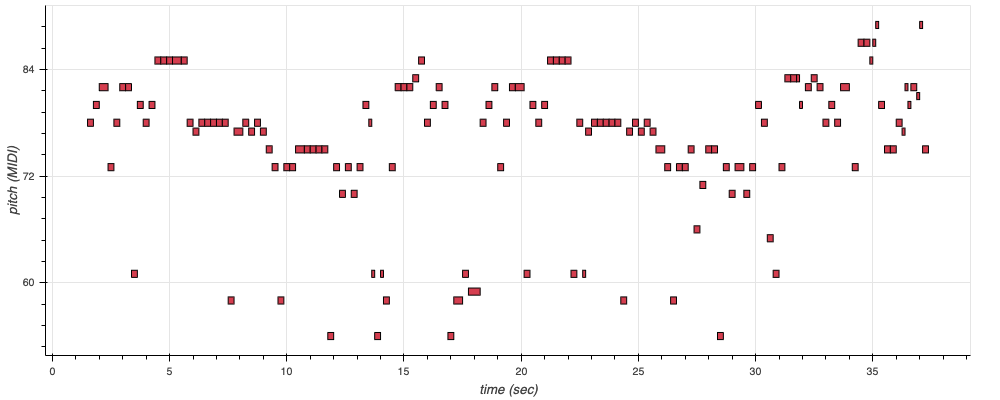
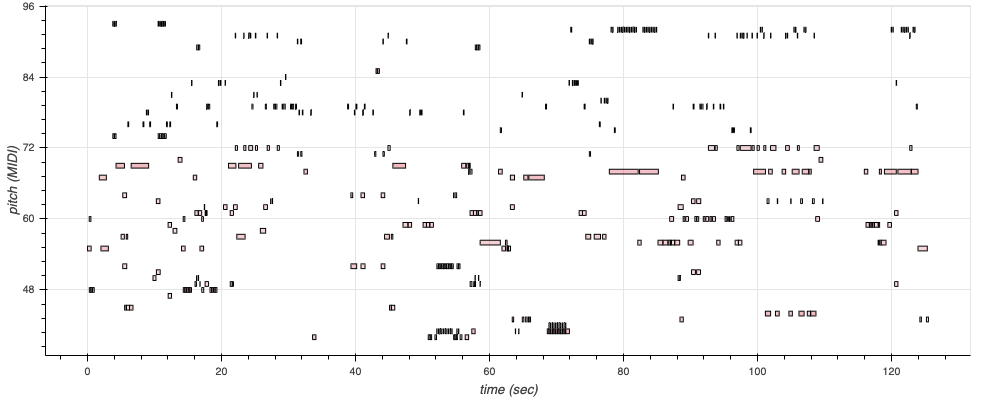
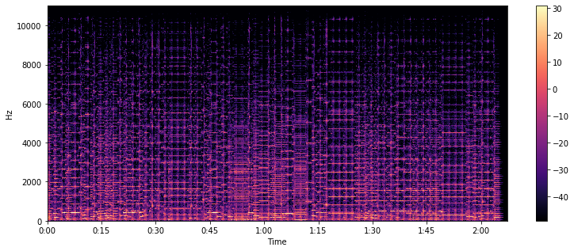
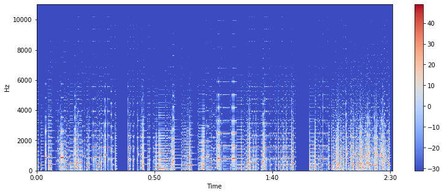
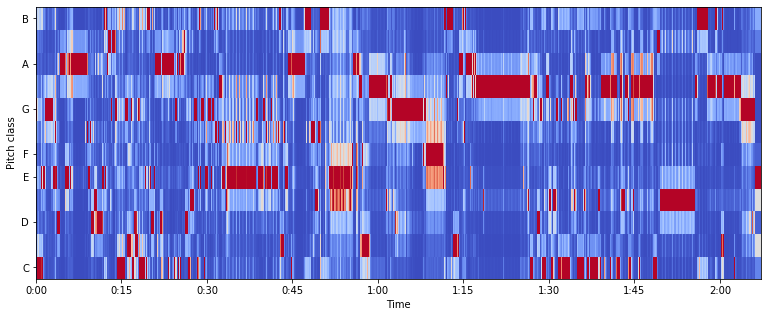
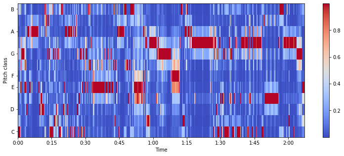

# TikTok Trendy Music Generation & Lyrics Generation

DSC160 Data Science and the Arts - Final Project - Generative Arts - Spring 2020

Project Team Members:
- Jou-Ying Lee, jol067@ucsd.edu
- Yunlin Tang, yut085@ucsd.edu
- Yupei Zhou, yuz522@ucsd.edu
- Sizhu Chen, sic100@ucsd.edu
- Yuanbo Shi, yus263@ucsd.edu

## Abstract

(10 points)

All sharing a Chinese cultural background, our group decides to base this generative art project primarily on music production of popular Chinese song tracks.

TikTok is a video-sharing social networking service owned by ByteDance, that has become one of the most downloaded mobile apps of the decade. With increasingly emerging markets all around the world, musics created, played, and sang on TikTok trend with great popularities, and pieces that top the charts of "most played songs on TikTok" has become a commonly referenced benchmark in China for signs of "trendy music." With this idea in mind, our group hopes to study these popular songs by decomposing the music audios and recomposing them into new audio tracks. Additionally, we are looking to employ text generating algorithms for novel lyric compositions based off of these trained music tracks.   

Specifically, we would be looking at current Chinese songs topping [TikTok Most-Played Music Chart](https://y.qq.com/n/yqq/toplist/60.html). Also, for generative modelling purposes, we would thereby only focus on one single instrument playing in the background music -- picked to be piano for this particular topic of interest.  
Building upon text generation with RNN introduced in class, we will be practicing the techniques for processing, predictive, and modelling goals on our own dataset of Chinese characters -- for lyric production purposes. Additionally, we will extend practices introduced on Google Magenta by combining with the use of the Spleeter library for music generations. From here, we are also aware of the many challenges involved: these include unpredictable performances and outputs our model has on Mandarin applications, processing inadaquacy in accurately recognizing input notes therefore leading to biased results, and possible failures in generating alternative note sequences while keeping the styles or harmonies, etc. However, we are also hoping to embrace all of these difficulties and consider them all as an exploratory part of our project.   
Judging from our prior understandings of most-played TikTok musics, we are anticipating the generated music piece to have a "poppy" or "bouncy" melody similar to most of those on the current chart. Although we do not expect the generated lyrics to make perfect sense, we do anticipate the overall content to convey of a "lovely theme" -- as this is again, what we are seeing from the latest songs topping the chart.  
Our project results would then be presented as a video clip of a sang out piece of our generated lyrics together with the generated audio piece as the background music. Lyrics are to be sang in Chinese, therefore we will also be providing a running display in the video of the exact lyrics (in Mandarin Chinese with English translations).  
Ideas and concepts of this work references a few prior projects and papers listed as follows:

- [MidiMe: Personalizing a MusicVAE model with user data](https://research.google/pubs/pub48628/)
- [Generation of music pieces using machine learning: long short-term memory neural networks approach](https://www.tandfonline.com/doi/full/10.1080/25765299.2019.1649972)
- [Neural Nets for Generating Music](https://medium.com/artists-and-machine-intelligence/neural-nets-for-generating-music-f46dffac21c0)
- [Classical Piano Composer](https://github.com/Skuldur/Classical-Piano-Composer)
- [Play it again, AI: a look at Google Magenta and Machine Learning for audio](https://tech.uqido.com/2020/02/13/play-it-again-ai-a-look-at-google-magenta-and-machine-learning-for-audio/)

## Data and Model

(10 points)

In the final submission, this section will describe both the data you use for this project and any pre-existing models/neural nets. For each you should provide the name, a textual description, and a link. If there is a paper (for neural net) link that as well.
- Such and such Neural Net. The short description of this neural net.
  - [link to code]().
  - [Title of Paper with Link]().
- Training data. Short description of training data including bibliographic info. [link to data]().

#### Model
Our project can be broken down to two major parts, that is audio generation and text generation. With different goals of applications, each are implemented with different models as well.  
1. Audio Generation
	- Classical-Piano-Composer: 

	- MelodyRNN: 
This model is made available from `magenta.music`. It is an LSTM-based language model for musical notes, and is best at continuing a NoteSequence given to it. 
For our particular implemented model, we leveraged pre-trained [basic_rnn](http://download.magenta.tensorflow.org/models/basic_rnn.mag) (.mag bundle files) supplied by magenta, and is then trained on the outcome of that Classical-Piano-Composer produced above.  
Details regarding this model is linked [here](https://github.com/tensorflow/magenta/tree/master/magenta/models/melody_rnn).

2. Lyrics Generation  
We train two word-level text generation models using RNN and LSTM. The entire lyrics corpus contains 3476 unique words (some are English words) and we slice the corpus into sequences of length 20 (20 words) for training. The batch size is set to be 64. The structure of these two models are as follows:
    - RNN:

      |Layer (type)              |Output Shape     |Param #  |  
      |--------------------------|-----------------|---------|  
      |embedding_2 (Embedding)   |(1, None, 300)   |1042800  |  
      |cu_dnngru_2 (CuDNNGRU)    |(1, None, 1024)  |4073472  |  
      |cu_dnngru_3 (CuDNNGRU)    |(1, None, 1024)  |6297600  |  
      |dense_2 (Dense)           |(1, None, 3476)  |3562900  |

    - LSTM:  

      |Layer (type)              |Output Shape     |Param #  |  
      |--------------------------|:----------------|---------|  
      |embedding_3 (Embedding)   |(1, None, 300)   |1042800  |  
      |cu_dnnlstm_2 (CuDNNLSTM)  |(1, None, 1024)  |5431296  |  
      |cu_dnnlstm_3 (CuDNNLSTM)  |(1, None, 1024)  |6297600  |  
      |dense_3 (Dense)           |(1, None, 3476)  |3562900  |

#### Data
- All data used in this project are personally obtained. For our generative tasks are seperated into audio and text production, raw data trained also include each seperate audio files and text files. 
- Our audio datas are originally videos obtained from [Youtube](https://www.youtube.com/) and [bilibili](https://www.bilibili.com/).
- [audio_midi.py](https://github.com/ucsd-dsc-arts/dsc160-final-group9/blob/master/code/audio_midi.py) contains all videos acquired. This python file is then imported into [audio-to-midi](https://github.com/ucsd-dsc-arts/dsc160-final-group9/blob/master/code/audio-to-midi.ipynb) for processing and conversions into `.wav` files (saved) [audio_wav](https://github.com/ucsd-dsc-arts/dsc160-final-group9/tree/master/data/audio_wav) and eventually into `MIDI` (saved) [audio_mid](https://github.com/ucsd-dsc-arts/dsc160-final-group9/tree/master/data/audio_mid). 
- Each of these scraped song's lyrics are saved as individual `rtf` files in [lyrics](https://github.com/ucsd-dsc-arts/dsc160-final-group9/tree/master/data/lyrics).

## Code

(20 points)

This section will link to the various code for your project (stored within this repository). Your code should be executable on datahub, should we choose to replicate your result. This includes code for:

- [audio-to-midi](https://github.com/ucsd-dsc-arts/dsc160-final-group9/blob/master/code/audio-to-midi.ipynb): `.ipynb` file for audio data acquisition and preprocessing from miscellaneous video formats to `.wav` audio format, and eventually conversions into `.mid` MIDI file types
- [MelodyRNN](https://github.com/ucsd-dsc-arts/dsc160-final-group9/blob/master/code/MelodyRNN.ipynb): complete `.ipynb` file with MelodyRNN's modelling and generative tasks
- code for preprocessing
- [Lyrics_generation_rnn](https://github.com/ucsd-dsc-arts/dsc160-final-group9/blob/master/code/Lyrics_generation_rnn.ipynb): complete `.ipynb` file with lyrics processing, model training and lyrics generation.
- training code (if appropriate)
- generative methods

Link each of these items to your .ipynb or .py files within this seection, and provide a brief explanation of what the code does. Reading this section we should have a sense of how to run your code.

## Results

(30 points)

This section should summarize your results and will embed links to documentation to significant outputs. This should document both process and show artistic results. This can include figures, sound files, videos, bitmaps, as appropriate to your generative art idea. Each result should include a brief textual description, and all should be listed below:

- image files (`.jpg`, `.png` or whatever else is appropriate)
- audio files (`.wav`, `.mp3`)
- written text as `.pdf`

### Audio Generation
<b>MelodyRNN</b>
- In an attempt to compare our generated song from Classical-Piano-Composer with actual songs currently on the <i>TikTok Trendy Music Chart</i>, we utilized a typical and popular song that has been long trending on Tiktok: <i>Meow Meow Meow</i>. This song's main Chorus was extracted and fed into our pre-trained MelodyRNN model to study the song's underlying stylistic components, and generate continuing notes for later use of inspecting if that generated by Classical-Piano-Composer resembles fashions of actual songs on the current chart.
- In order to ensure comparing component is only on musical styles, we made sure that the generated melodic sequence are of the same length. `temperature`, as an important hyper-parameter in MelodyRNN to manipulate how random the output sequence is, is also maintained to be `1.7` throughout all model fittings as well.
- This first graph is a visualization of the prediction data which according to the model best approximates the notes that when played on the piano at the predicted time frames and with the predicted velocities would produce <i>Meow Meow Meow</i>. This graph is done using <i>Bokeh</i>, and therefore is interactive if you view it in [MelodyRNN.ipynb](https://github.com/ucsd-dsc-arts/dsc160-final-group9/blob/master/code/MelodyRNN.ipynb). 

- This following second graph plots the generated new <i>Meow Meow Meow</i> (audio file linked [here](results/melody_rnn/rnn_meow.wav)). With time frames all set the same, it can be seen from this comparison, that the generated notes seem to on average each last shorter in time. As we can see that those blocks in this graph tends to be smaller (horizontally) compared to those above. One thing to also notice is how this generated audio shows higher notes to the end of our output sequence than the original rendered song. This might be due to the model learning the overall notes in the training sequence being highly upbeat, and therefore producing an output trend at the end of increasing pitch. However, this might just be a generalized discussion, more precise analysis would be needed for more accurate justifications. 

- For purpose of further inspecting <i>Classical-Piano_Transformer</i>'s output melody, a continuing melody is also generated by fitting that output from <i>Classical-Piano-Transformer</i> to <i>MelodyRNN</i>. The following two images are each of visualization of the original generated audio, and the one of MelodyRNN's output. 
It can be seen from the plotted notes, that most of the patterns of the continuing melody follows pretty similar trends as that of the input classical-piano-composer. Exception applies to that towards the end of the melody, beginning at around 120s. One thing to notice is that this is the original input piece ends at around 2 minutes, but our generating melody prolongs to a little over this duration. Randomness after this timespan is therefore pretty apparent via this top-bottom comparison.

- Considering the following two plotted log-scaled spectograms -- a visual way of representing the signal strength over time at various frequencies present -- the original fitted Classical-Piano-Composer (top), and that output of MelodyRNN (bottom) unsurprisingly shares a same scale of max and min hertz. However, they have pretty different majority spread of their frequencies. By a log-transformation applied on the frequencies, it can be seen that the majority of Classical-Piano-Composer's output has sound intensity above -10dB for log-scaled frequency of between 64 to 512 Hz; While that for the generated melody, hearable log-scaled frequeny mostly falls between 128 to 1024 Hz with a sound intensity of around 10 to 40 dB.  
While it is difficult to tell directly from this comparison why the reason for this is, but one possible explanation may be due to MelodyRNN specifically learning "bumpy" notes and rhythms from the input audio, leading the overall pitch to turn out to be higher.

- The following two plots are visualized chroma features fitted to our two melodies in topic of dicussion. This is a typically 12-element feature vector indicating how much energy of each pitch class {C, C#, D, D#, E,..., B} is present in the signal. This provides a robust similarity measure between music pieces. The <i>redder</i> corresponds to greater presence, and therefore the first thing that comes to our eyes might be the absence of the two vertical orange bars from the graph on the top in the bottom. This might be indicating a drawback in MelodyRNN for not being proficient in learning combinations of pitches in a single note. However, one thing particularly interesting and important to notice is how MelodyRNN did a great job on <i>"continuing"</i> the sequence. In that above (output of Classical-Piano-Composer): notes towards the end of the melody start to get bumpy with high variations in short amound of time (told by: to the right of the graph, notes are squished together, with red scattered across different pitches); At the same time, looking at that in the beginning of MelodyRNN's output (bottom plot): it started with just the similar pattern. While this might be difficult to tell just from listening to the audio files, such statistical analysis however did reveal some learning patterns of that of MelodyRNN.

### Lyrics Generation
<b>Lyrics_generation_rnn</b>  
- The reason we choose to use word-level models is that character-level models do not perform so well. We experiment with character-level models and the results generally don't make too much sense in Chinese. This is why we use the jieba package to segment the corpus into words and train our models on these words. A caveat of this is that the segmentation is not necessarily 100% correct since jieba uses essentially a probabilistic model to find the most probable result and there are cases when it does not perform ideally.
- We train the RNN model for 30 epochs and the LSTM model for 50 epochs. The training loss of both models are as follows:  

- When generating lytics using trained models, we set `temperature` to be 1.1 to see some interesting combinations of words. The output from the RNN model can be found [here](https://github.com/ucsd-dsc-arts/dsc160-final-group9/blob/master/results/lyrics_generation_rnn/lyrics_rnn.txt). The output from the LSTM model can be found [here](https://github.com/ucsd-dsc-arts/dsc160-final-group9/blob/master/results/lyrics_generation_rnn/lyrics_lstm.txt). We can see that some lines make more sense than others and some lines are very similar to the lyrics corpus that we collect.

## Discussion

(30 points, three to five paragraphs)

The first paragraph should be a short summary describing your results.

The subsequent paragraphs could address questions including:
- Why is this culturally innovative?
- How does your generative computational approach differ from traditional art/music/cultural production?
- How do your results relate to broader social, cultural, economic political, etc., issues?
- What are the ethical concerns for this form of generative art?
- In what future directions could you expand this work?

The results of our project can be broken into two parts: audio generation and lyrics generation. First, the audio generation uses Skuldur’s Classical Piano Composer model to output a segment of melody. The input audio files for this model are obtained from YouTube and Bilibili websites, which include a number of selected popular TikTok songs. As shown in the above result section, the generative audio is indeed not melodic and euphonic enough. However, there are some repeated movements of sounds throughout this audio that are actually similar rhythms founded in the input Tiktok music as we can tell. One thing to be noticed is that this generative music has many redundant notes which can implicitly demonstrate the repetitive and similar notes used in Tiktok music. To compare with this result, we also use the melodyRNN to generate another segment by training the song “Meow Meow Meow”, which is also a popular song in Tiktok. The output from this model tends to have a higher pitch and a faster tempo. It reveals the fact that this song has a satisfying harmony with multiple notes layering on each other and a cheerful mood. Second, the lyrics generation deploys two neural network models: RNN and LSTM. Both models generate appropriate lyrics based on the input from selected Tiktok songs. The results from RNN have a prominent Chinese antique style. For example, the diction in the lyrics are traditionally exquisite: icy river ink(冰河墨), bluestone(青石板), and samsara(轮回). In addition, both lyrics have the theme of the love relationship. These outputs from models are greatly representative among all the Chinese Tiktok prevalent songs, which use traditional style elements in lyrics to depict some love stories.

The generative methods used in our project for music/audio and lyrics are both based on the neural network models. For the audio generation, two models are implemented: the Classical-Piano-Composer and the MelodyRNN. First, the Classical Piano Composer allows users to train a neural network (multi-layer LSTM network) to generate mid music files that make use of a single instrument. In the process of training, the network will use every input midi file/song that only contains a single instrument, which we choose the piano. Then the trained model can generate prediction audio out of the input songs by encoding the midi notes in terms of sequences or sets of notes. Similarly, the MelodyRNN applies language modeling to melody generation by using an LSTM (long short-term memory) network as well. It implements the RNN (Recurrent Neural Network) model to generate the melody. The input of MelodyRNN should be a segment of melody in midi format; the corresponding output is also a midi file which predicts the successive melody. To compare with our audio generation models, the traditional way of making music melody is more complicated for ordinary people. First of all, the user at least has to know some musical background knowledge to create a piece of melody and work with a vocalist. Then as the producer, people would need to write some chords to be matched with the melody; and find the key and scale to identify which notes can be used for the melody. Lastly, the melody has to be played and recorded down for testing the effectiveness. Therefore, for those who have limited knowledge in music (like us), using the neural network models is much more convenient and accessible since it learns the features from the input songs and predicts/generates the new melody. It also creates and offers numerous opportunities for people with different educational backgrounds in exploring the possibilities in music generation to some extent. For the text generation, we employ two models respectively to generate the new lyrics: RNN and LSTM. First, the RNN model is a special type of artificial neural network. It generates the text by sampling the next word based on the probability distribution of the last word of the current sequence. This model is prevalent in text generation since it works effectively with sequential data such as the lyrics. Second, the LSTM model is also a class of artificial recurrent neural network which has feedback connections between layers. It is powerful when learning the dependencies between the words/characters that appeared in the input text. According to our results, both models produce some meaningful and interesting lyrics based on the input lyrics of  Tiktok songs. On the other hand, the traditional way to create the lyrics for a song is just handwritten by people. In order to generate lyrics for certain genres/types of songs (the popular Tiktok music, etc), the lyricist need to explore the similarity between these trending songs and manually write out the desired text. Although the results of the handwritten texts would be more meaningful and understandable in natural languages, this generating process would be more expensive both in time and human labor resources. The productions from the neural network models would be more precise and predictable even though they might result in worse readability.

<i>Illustration for RNN</i>

 

The main goal of our project is to generate melodies and lyrics that are similar to the trending Tiktok songs. As one of the most recent and popular apps in the Chinese network market, Tiktok (douyin) becomes more and more influential in Chinese society in both the cultural and economical aspects. It is a video-sharing social networking service that is owned by the ByteDance company. Tiktok successfully innovates a new type of social media which allows users to record and post some short videos between 15 seconds to several minutes. It attracts mobile users in several potential ways. For example, it is very convenient to download and use. The viewers can watch the videos and listen to audios by streaming without downloading any actual media files. The creators can simply record and upload their contents by using their mobile phones. Tiktok also offers flexibility and availability for its users to view contents that allow them to utilize the fragments of time and kill the bored. In addition, Tiktok employs several advanced AI algorithms to analyze users’ interests and preferences by digesting their interactions with the posted contents such as “likes”, comments, and the lengths of viewing time. These algorithms can ensure the app to display the most fitted content for users’ personal interests. Such algorithms can constantly provide positive rewards for the human brains in the cognitive process while the users swipe for the next videos and find out that these contents are indeed interesting thus hold the users’ attention. Due to the increased popularity of Tiktok, the background music used in these posted videos also bring their cultural and economical influence on Chinese society, especially on the youth. A key element that contributes to the success of Tiktok is the charm of music. In Tiktok, music artists often use various types of marketing methods to promote their newly released songs such as making dance/song challenges, memes, and cover versions. Other users can simply just add these songs in their own videos to catch the new trend and attract more users for watching. While the original content is powerful, the remixing of music/dance provides other users the opportunities to layer context and self-expression. It is a win-win result for both music producers and other bloggers to facilitate the use of music. Therefore, the application of Tiktok music creates numerous commercial opportunities in the competitive internet market and influences the trend of Chinese music in the real world. 

<i>The Fast Growth of Tiktok App</i>

 

However, our results from the generative methods actually reflect the social phenomenon and indicate some potential broader issues. In general, we found out that all of the trending Tiktok music (including the generative output from neural network models) have the same characteristics: simple and similar melody and repeated chords. Most of the Tiktok songs can be classified as catchy songs that have high remembrance and similar melody thus make the listeners passively memorize. According to the earworm effect, these “sticky” music can continually repeat through a person’s mind after it is no longer playing. In order to achieve this effect, many artists and producers choose to make monotonous songs for attracting users and gain popularity in Tiktok since it only offers a short-timed opportunity for displaying the video advertisement. It is no doubt that this marketing strategy is successful; however, it also brings some concerns. First, the “lifetime” of these songs are relatively short. It is easy for these songs to gain popularity in Tiktok, but it is also easy to be decayed and lose prevalence in this fast-paced and competitive market. Since it is cheap to produce such music, the growth in the number of catchy Tiktok songs is accelerated. Therefore, the mobile users in Tiktok would quickly lose the feeling of freshness and move their favor toward other songs since the new songs are continuously emerging. Second, the abuse in the use of earworm melody would potentially harm the variety of music genres and artistic production. While more and more companies and musicians accept the benefits of using simple and similar chords to attract their viewers, the significance of unique and diverse music productions would be underestimated. Third, these catchy songs can be viewed as fast moving consumer goods which evoke negative consumerism in the Chinese society. Some criticism toward consumerism indicates that the strong and unhealthy tendency of people to identify with products or services they consume. Under the influence of consumerism, people pursue fast satiety from cheap or luxury goods as their life goal and value. These catchy songs and their similar lyrics can potentially provide rapid satisfaction for their consumers by giving the illusion of conformity by being a member of the Tiktok community. The Tiktok users, especially the youth, tend to identify themselves as the one who catches up with the popularity thus provide them a sense of belonging. However, such a form of consumerism can possibly harm their critical thinking ability as long as they consume cheap and fast entertaining products such as similar catchy songs and meaningless lyrics as reflected in our results. 

<i>meme of people who has the earworm effect by the Tiktok music</i>

 

<i>most of Tiktok users are the youth</i>

 

In addition, we also have some concerns about our project such as the limitation and ethical issues. When choose the data, we have limited ourselves by selecting the Chinese songs and omitting other languages, which would affect our results if other popular TikTok songs have been added in. Since we choose to use the piano as the instrument to produce the melody, we are also omitting some songs that do not have the piano cover version. These limitations can be improved in the future for extending our project. In addition, to expand our works, we can also consider using the music elements of beat, tempo, and dynamics in audios to generate a more sophisticated result. We also can consider using other neural network models to produce better text and audio prediction.

## Team Roles

- Jou-Ying Lee, jol067@ucsd.edu
	- Wrote Abstract
	- Obtained and processed audio and text data
	- Completed MelodyRNN modelling (MelodyRNN.ipynb)
	- Drafted <i>Results</i> for MelodyRNN in the corresponding section.
	- Finished composition of <i>Technical Notes and Dependencies</i> for <i>audio-to-midi.ipynb</i> and <i>MelodyRNN.ipynb</i>
- Yunlin Tang, yut085@ucsd.edu
	- wrote discussion
- Yupei Zhou, yuz522@ucsd.edu
	- Processed lyrics data for lyrics generation
	- Completed lyrics generation (Lyrics_generation_rnn.ipynb)
	- Drafted corresponding sections of <i>Results</i> for lyrics generation
	- Drafted corresponding sections of <i>Technical Notes and Dependencies</i> for <i>Lyrics_generation_rnn.ipynb</i>
- Sizhu Chen, sic100@ucsd.edu
- Yuanbo Shi, yus263@ucsd.edu

## Technical Notes and Dependencies

Any implementation details or notes we need to repeat your work.
- Additional libraries you are using for this project
- Does this code require other pip packages, software, etc?
- Does this code need to run on some other (non-datahub) platform? (CoLab, etc.)

Our codes are solely based on Python programming language. The following packages and libraries are therefore all of Python dependencies. While most ipynb files include necessary pip installs within themselves, there are some additional installs needed. 
#### [audio-to-midi.ipynb](https://github.com/ucsd-dsc-arts/dsc160-final-group9/blob/master/code/audio-to-midi.ipynb)
`youtube-dl` package enables downloading videos from youtube.com or other video platforms
pip installation can be done by: 
<pre><code>sudo -H pip install --upgrade youtube-dl</code></pre>
macOS users can also install with Homebrew:
<pre><code>brew install youtube-dl</code></pre>
#### [MelodyRNN.ipynb](https://github.com/ucsd-dsc-arts/dsc160-final-group9/blob/master/code/MelodyRNN.ipynb)
Processing included in this notebook relies greatly on `Magenta`, especially `magenta.music` for music generation. This library provides numerous Machine Learning Models built with <i>TensorFlow</i>, and therefore they run faster on a GPU. For this reason, this notebook is implemented with commands to be run on <b><i>Google Colab</i></b>. 
The following is included in the notebook already, and shall be run for proper execution of later codes. 
Setup environment as:
<pre><code>%tensorflow_version 1.x
from __future__ import absolute_import
from __future__ import division
from __future__ import print_function
from __future__ import unicode_literals

import glob

!rm -r /content/onsets-frames
!mkdir /content/onsets-frames
!gsutil -q -m cp -R gs://magentadata/models/onsets_frames_transcription/* /content/onsets-frames/
!unzip -o /content/onsets-frames/maestro_checkpoint.zip -d /content/onsets-frames
CHECKPOINT_DIR = '/content/onsets-frames/train'</code></pre>
Important dependendies are to be installed and imported: 
`libfluidsynth1` is a real-time MIDI software synthesizer. 
`pyfluidsynth` is a Python bindings for FluidSynth, a MIDI synthesizer that uses SoundFont instruments. 
`pretty_midi` contains function/classes for handling MIDI data. 
`pafy` is a Python library to download YouTube content and retrieve metadata. 
`spleeter` is a library and <i>Tensorflow</i> model that achives state-of-the-art source separation from audio files. 
`magenta` is a <i>Tensorflow</i> library that explores machine learning in processes of creating art and music.
<pre><code>!apt-get update -qq && apt-get install -qq libfluidsynth1 fluid-soundfont-gm build-essential libasound2-dev libjack-dev ffmpeg  
!pip install pyfluidsynth pretty_midi youtube-dl Pafy
!pip install spleeter

import pafy

if glob.glob('/content/onsets-frames/magenta*.whl'):
  !pip install -q /content/onsets-frames/magenta*.whl
else:
  !pip install -qU magenta</code></pre>

This is the hack to allow python to pick up the newly-installed fluidsynth lib, and is only needed for the hosted Colab environment.
<pre><code>import ctypes.util
orig_ctypes_util_find_library = ctypes.util.find_library
def proxy_find_library(lib):
  if lib == 'fluidsynth':
    return 'libfluidsynth.so.1'
  else:
    return orig_ctypes_util_find_library(lib)
ctypes.util.find_library = proxy_find_library</code></pre>
`midi2audio` makes it easy to use MIDI to audio or playback via FluidSynth.<pre><code>!pip install midi2audio</code></pre>
`fluidsynth` is a software synthesizer based on the SoundFont 2 specifications. This additional installation is required for `midi2audio` to properly work for our purpose.<pre><code>!sudo apt-get install fluidsynth</code></pre>

#### [Lyrics_generation_rnn.ipynb](https://github.com/ucsd-dsc-arts/dsc160-final-group9/blob/master/code/Lyrics_generation_rnn.ipynb)
The only additional package to install for this file is [jieba](https://github.com/fxsjy/jieba), which is a great tool for Chinese text segmentation. The following installation command is embedded at the beginning of this file.
<pre><code>!pip install jieba --user</code></pre>

Since models for lyrics generation uses the GPU variant of RNN and LSTM layers, we recommend that the file to be run on DataHub.  

## Reference

All references to papers, techniques, previous work, repositories you used should be collected at the bottom:
- Papers
- Repositories
	- https://github.com/tensorflow/magenta/tree/master/magenta/models/melody_rnn
	- https://github.com/ytdl-org/youtube-dl
	- https://github.com/tensorflow/magenta
	- https://github.com/fxsjy/jieba
	- https://github.com/roberttwomey/dsc160-code/blob/master/examples/text-generation-rnn.ipynb
	- https://github.com/Skuldur/Classical-Piano-Composer
- Blog posts
	- https://tech.uqido.com/2020/02/13/play-it-again-ai-a-look-at-google-magenta-and-machine-learning-for-audio/
	- https://towardsdatascience.com/text-generation-using-rnns-fdb03a010b9f
- Others
	- https://craffel.github.io/pretty-midi/
	- https://pypi.org/project/pyFluidSynth/
	- https://packages.debian.org/sid/libfluidsynth1
	- https://pythonhosted.org/pafy/
	- https://pypi.org/project/midi2audio/
	- http://www.fluidsynth.org/api/
	- https://www.tensorflow.org/api_docs/python/tf/compat/v1/keras/layers/CuDNNLSTM
	- https://www.tensorflow.org/api_docs/python/tf/compat/v1/keras/layers/CuDNNGRU
	- https://en.wikipedia.org/wiki/Earworm 
	- https://en.wikipedia.org/wiki/Consumerism

